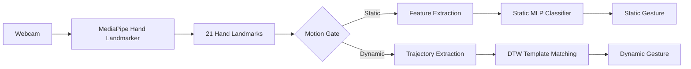

# Real-Time Hand Gesture Recognition

A real-time hand gesture recognition system designed for lightweight execution on resource-constrained devices such as the Raspberry Pi.

The system uses **MediaPipe Hand Landmarker** to extract 21 hand landmarks from a webcam stream and combines two complementary recognition approaches:

- **Static gesture recognition** using hand-pose features and a lightweight MLP classifier.
- **Dynamic gesture recognition** using hand trajectories and Dynamic Time Warping (DTW).

The recognition pipeline first determines whether the detected hand is approximately **static or dynamic**. Static gestures are classified based on the hand pose, while dynamic gestures are recognized by comparing their motion trajectories with stored gesture templates.


## Overview

The main goal of the project is to recognize a limited set of hand gestures in real time while keeping the computational cost low enough for deployment on a Raspberry Pi.

Instead of feeding full camera frames directly into a large image-classification network, the system uses MediaPipe to convert each frame into a compact representation of the hand:



This design avoids running a heavy image classification model for every frame and separates static pose recognition from motion-based gesture recognition.


## Features

- Real-time hand detection using MediaPipe Hand Landmarker
- Support for a single detected hand
- Static gesture classification using a lightweight MLP
- Dynamic gesture recognition using Dynamic Time Warping (DTW)
- Automatic static/dynamic motion classification
- Multiple trajectory representations: (Wrist, Hand-center, Fingertip)
- Confidence-based rejection of uncertain predictions


## Supported Gestures

The project currently uses two different categories of gestures.

### Static Gestures

Static gestures are recognized from the spatial configuration of the hand.
The current dataset-generation pipeline supports arbitrary class labels:

- `like`
- `dislike`

Additional static classes can be collected using the webcam dataset generator.

### Dynamic Gestures

Dynamic gestures are recognized from their movement trajectory.
The current implementation contains templates for:

- `increase_volume`
- `decrease_volume`
- `bye`

The trajectory representation was first selected according to the characteristics of each gesture but eventually is selected by all methods

| Gesture  | Description |
| --- | --- |
| `increase_volume` | Hand moves diagonally upward |
| `decrease_volume` | Hand moves diagonally downward |
| `bye` | Gesture mainly depends on hand movement/shape around a relatively stable wrist |


## Project Structure

```text
Real-Time-Gesture-Recognition/
│
├── data_generation/
│   ├── __init__.py
│   ├── convert_HaGRID_tocsv.py          # HaGRID landmark data conversion
│   ├── convert_to_enhanced.py           # Enhanced feature dataset generation
│   ├── dynamic_generate_dataset.py      # Dynamic gesture template generation
│   └── static_generate_dataset.py       # Static gesture dataset generation
│
├── src/
│   ├── __init__.py
│   ├── main.py                          # Real-time gesture recognition
│   ├── motion_gate.py                   # Static/dynamic motion classification
│   ├── dynamic_detection.py             # DTW-based dynamic gesture detection
│   └── artifacts/                       # MediaPipe models and recognition artifacts
│
├── training/
│   ├── static_train.py                  # Static gesture model training
│   └── static_inference.py              # Static gesture model inference
│
├── datasets/                            # Generated datasets and dynamic gesture templates
│   └── ...
│
└── README.md                            # Project documentation
```


# Pipeline

## 1. Hand Landmark Detection

Each webcam frame is processed using the **MediaPipe Hand Landmarker**.
For each detected hand, MediaPipe provides 21 landmarks with normalized: `x`, `y`, `z`


## 2. Static Gesture Recognition

Static gestures are recognized from the spatial configuration of the hand.

### 1. Feature Extraction

For every detected hand, the system extracts **83 features**.

#### Relative Landmark Coordinates (63 features)

The coordinates of all 21 landmarks are normalized relative to the wrist (landmark `0`).
For each landmark:
`x - wrist_x`, `y - wrist_y`, `z - wrist_z`
This produces:`21 × 3 = 63 features`

Using wrist-relative coordinates makes the representation less dependent on the absolute position of the hand in the camera frame.

#### Finger Extension Ratios (5 features)

For each finger, the system calculates the ratio between:
`distance(MCP, TIP) / distance(MCP, PIP)`
The five resulting values describe how extended each finger is.

#### Finger Angles (5 features)

An angle is calculated between the wrist and each fingertip using `atan2`.
This produces one angular feature for each of the five fingers.

#### Fingertip Distances (10 features)

The pairwise Euclidean distances between the five fingertips are calculated.
The number of unique pairs is:
`5 × 4 / 2 = 10`.
Therefore, the final feature vector is:
`63 landmark coordinates + 5 extension ratios + 5 angles + 10 fingertip distances = 83 features`


### 2. Static Dataset Generation

Static training data can be collected directly from a webcam using:

```bash
python data_generation/static_generate_dataset.py
```

The script asks for the class label:

```text
Enter the class label for this recording session:
```

For example, valid classes are: 

`like`,`dislike`,`unknown`

During recording:

- `SPACE` pauses/resumes data collection.
- `Q` exits the program.
- Hand landmarks are detected using MediaPipe.
- A sample is collected every 5 frames (flexible).
- Extracted features are appended to the CSV dataset.
- Collected 1500 samples per class (flexible).

The generated dataset contains one row per sample:

```text
label,
x0, y0, z0,
x1, y1, z1,
...
x20, y20, z20,
extension0, ...,
angle0, ...,
tip_dist_0_1, ...
```


### 3. Static Model Training

The static classifier is trained using:

```bash
python training/static_train.py
```

The training script supports three classifier types.

```python
MODEL_TYPE = 'mlp'
```

Available options are:
`mlp`, `rf`, `svm`

#### MLP

The current default classifier is a lightweight `MLPClassifier` with:

```text
Hidden layer:      64 neurons
Activation:        ReLU
Batch size:        16
Learning rate:     0.001
Early stopping:    enabled
Validation split:  10%
Alpha:             0.01
```

The feature vectors are standardized using `StandardScaler` before classification.

#### Random Forest

An alternative lightweight Random Forest configuration is available:

```text
Number of estimators: 2
Maximum depth:        3
```

#### SVM

The SVM alternative uses:

```text
Kernel: RBF
C:      1.0
Gamma:  scale
```

The dataset is split using a stratified 80/20 train-test split.
The training script also generates a confusion matrix and saves the trained classifier and scaler using Python pickle.


## 3. Dynamic Gesture Recognition

Dynamic gestures cannot be reliably recognized from a single frame because their meaning depends on the movement of the hand over time.

For this reason, the project maintains a temporal history of hand landmarks and represents a dynamic gesture as a trajectory.
The system supports three trajectory representations.

### 1. Wrist Trajectory

Uses landmark `0`:`(x_wrist, y_wrist)`

This is useful for gestures where the primary information is the movement of the entire hand.
For example:`increase_volume`,`decrease_volume`

### 2. Hand Center Trajectory

The center is calculated as the mean position of all 21 landmarks.
This representation can be useful when the hand shape changes while the wrist itself remains relatively stable.


### 3. Fingertip Trajectory

The trajectory is calculated from the average position of the five fingertips.
This representation captures the overall movement of the fingertips.

### 4. Dynamic Template Generation

Dynamic gesture templates can be recorded using:

```bash
python data_generation/dynamic_generate_dataset.py
```

The recorder currently provides three gesture classes:

```text
0 → increase_volume
1 → decrease_volume
2 → bye
```


### 5. Dynamic Gesture Matching

Dynamic recognition is implemented in:

```text
src/dynamic_detection.py
```

Each gesture can have multiple stored templates.
For every incoming gesture, the system calculates DTW distances between the current trajectory and the trajectory that is extracted from stored landmarks.

### 6. Dynamic Time Warping

DTW is used because two executions of the same gesture do not necessarily have the same duration or frame-by-frame timing.
The algorithm builds a cost matrix between the two trajectories and finds the minimum-cost alignment.
A lower DTW distance means the trajectories are more similar.

Before DTW comparison, trajectories are translation-normalized by shifting their first point to:
`(0, 0)`


### 7. Multi-Trajectory Matching

For every gesture, the system independently calculates similarity scores for:
`wrist`, `center`, `fingertips`

For each representation, the best matching template is selected.
The resulting confidence values are then averaged:

```text
combined_confidence =
    mean(
        wrist_confidence,
        center_confidence,
        fingertips_confidence
    )
```

The gesture with the highest combined confidence is selected.
A dynamic gesture is accepted only when the resulting confidence exceeds the configured threshold.
The current threshold in the real-time pipeline is:
`0.85`


## 4. Motion Gate

Before deciding which recognition method to use, the system determines whether the current hand movement is **static** or **dynamic**.

This functionality is implemented in:

```text
src/motion_gate.py
```

The `MotionGate` maintains a rolling history of hand landmarks.
For every new frame, the displacement of each landmark from the previous frame is calculated.
The motion energy is then computed as:

`
total_velocity =
    sum(
        Euclidean displacement of each landmark
    )
`

The system maintains a history of these velocity values and calculates:

- Average velocity
- Velocity variation, used as an acceleration-related measure


A motion is classified as dynamic when either the velocity or acceleration-related threshold is exceeded.
Otherwise, it is considered static.


## 5. Real-Time Inference

The complete real-time application can be started with:

```bash
python src/main.py
```

The application:

1. Opens the webcam.
2. Captures frames at 640×480.
3. Detects a hand using MediaPipe.
4. Extracts the 21 landmarks.
5. Updates the motion history.
6. Determines whether the hand is static or dynamic.
7. Routes the input to the appropriate recognition method.
8. Displays the predicted gesture and confidence.
9. Displays FPS and average hand-landmark inference time.

The output window displays the landmarks with :
`Motion (static/dynamic)`,
`Gesture`
`Confidence`


# Running the Project

The project is implemented in Python.
A suitable Python environment should be created before running the project.

```bash
python -m venv .venv
```

Activate the environment (Linux / Raspberry Pi):

```bash
source .venv/bin/activate
```

Then install the required packages:

```bash
pip install -r requirements.txt
```


Download and prepare the MediaPipe Model.
```bash
wget -q https://storage.googleapis.com/mediapipe-models/gesture_recognizer/gesture_recognizer/float16/latest/gesture_recognizer.task
wget -q https://storage.googleapis.com/mediapipe-models/hand_landmarker/hand_landmarker/float16/latest/hand_landmarker.task
```
Place the required MediaPipe hand-landmarker model in:

```text
src/artifacts/hand_landmarker.task
```


Run the Complete Real-Time System


```bash
python src/main.py
```

The application automatically chooses between static and dynamic recognition based on the detected hand motion.